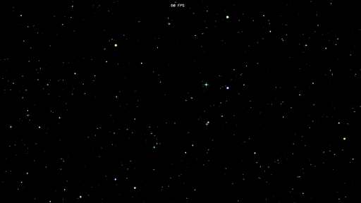

ssstars_opengl
==============

C++ and OpenGL Windows screensaver similar to ssstars.scr.

Screenshots
-----------



[Movie (mp4)](./screenshots/ssstars_opengl_ss.mp4)

Install
-------

Copy 1 files to your Windows system folder.

* ssstars\_opengl.scr

```
Windows 64bit : C:\Windows\SysWOW64\
Windows 32bit : C:\Windows\System32\
```

The screen saver name is "Stars GL".

This program saves settings in ini files. It will be created in the following location.

```
%APPDATA%\ssstars_opengl\ssstars_opengl.ini

For Windows10 : C:\Users\(USERNAME)\AppData\Roaming\ssstars_opengl\ssstars_opengl.ini
```

Uninstall
---------

Please delete the following files.

```
C:\Windows\SysWOW64\ssstars_opengl.scr (or C:\Windows\System32\ssstars_opengl.scr)
%APPDATA%\ssstars_opengl\ssstars_opengl.ini
```

Build Requirement / Environment
-------------------------------

* Windows10 x64 22H2
* MinGW (gcc 6.3.0)
* windres 2.28 (in binutils package)
* xxd 1.10 (in vim package)
* Python 3.10.10 64bit
* pillow 10.2.0

Please enter "make".

License
-------

CC0 / Public Domain

Author
------

[mieki256](https://github.com/mieki256)

Use font
--------

[ProFont for Windows, for Macintosh, for Linux](https://tobiasjung.name/profont/)

Use library
-----------

[nothings/stb: stb single-file public domain libraries for C/C++](https://github.com/nothings/stb)
